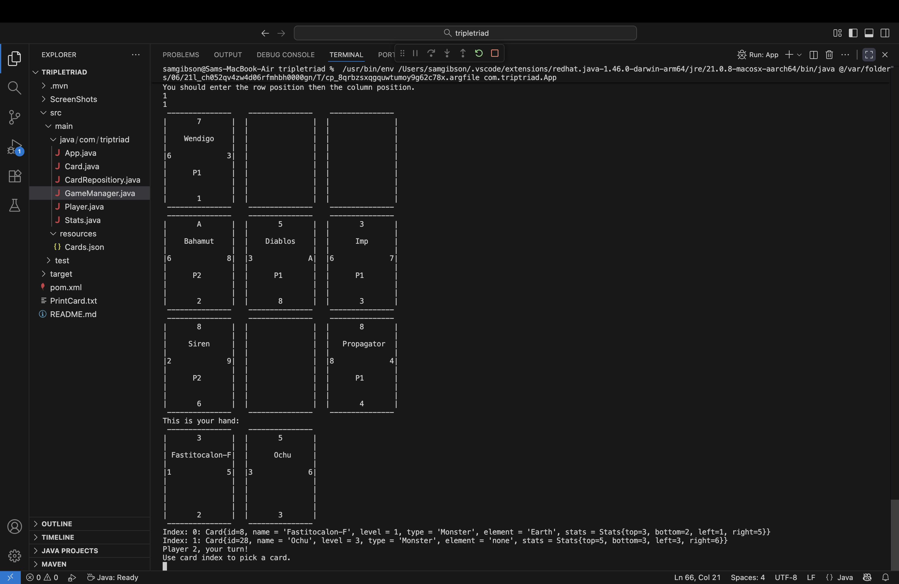
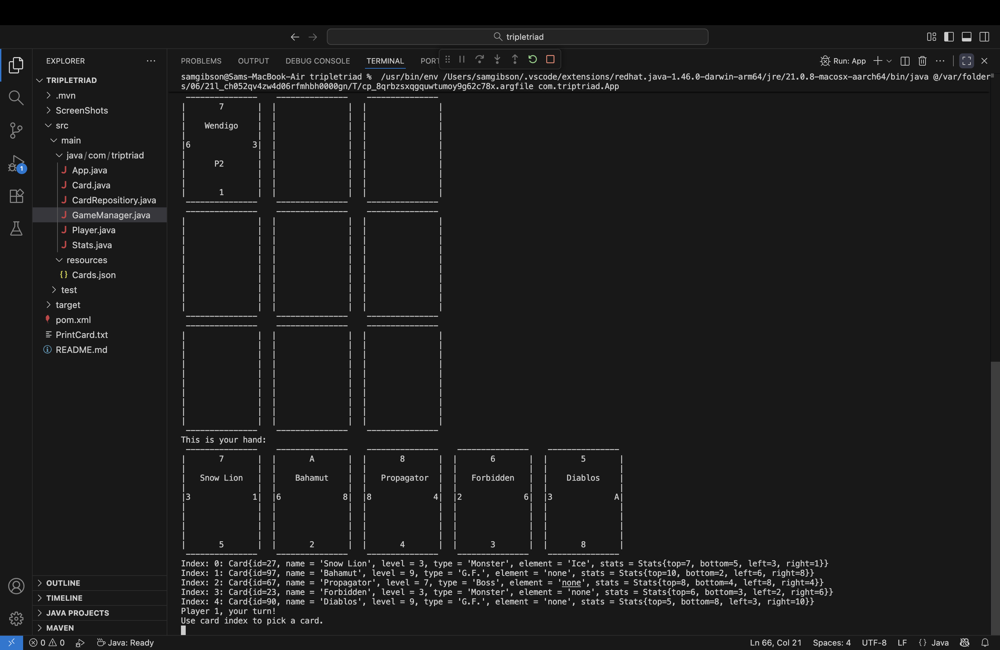
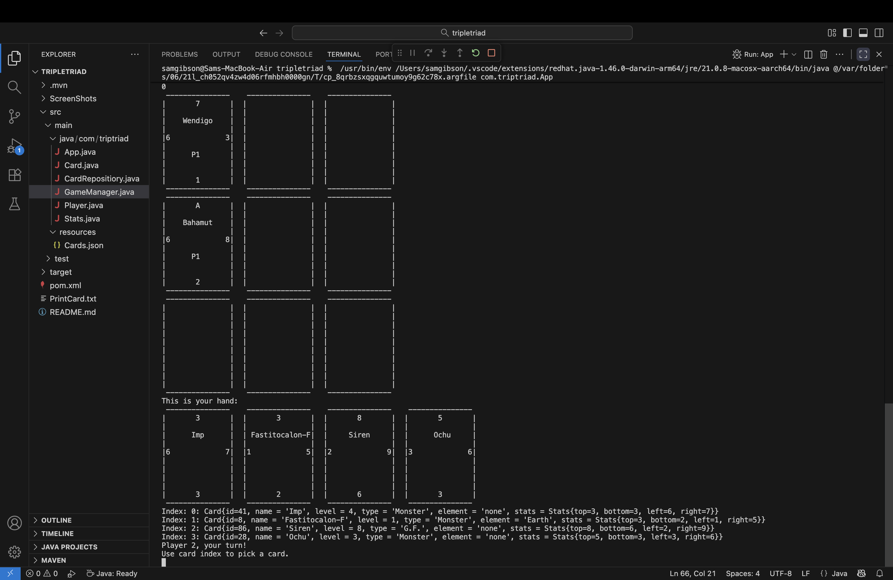
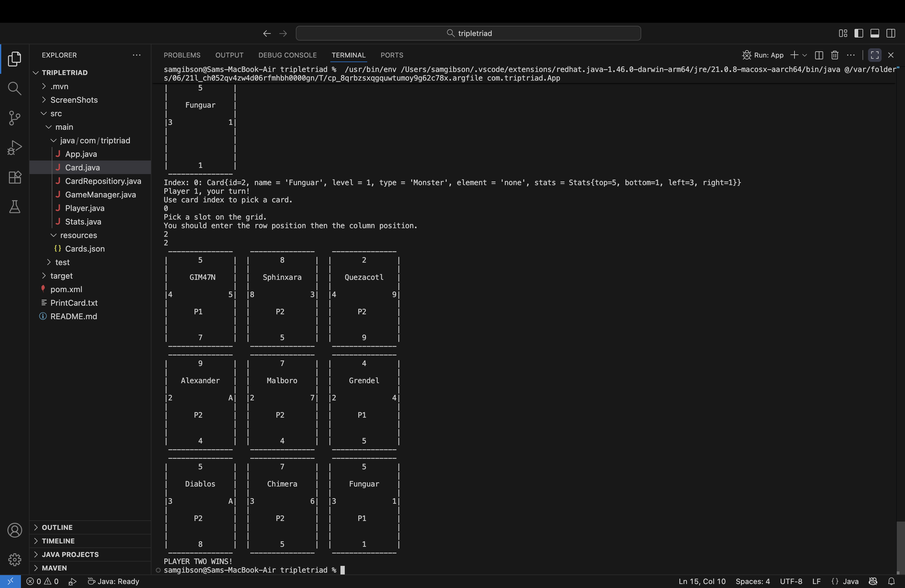

Triple Triad (Console Edition)

A simple, text-based recreation of Triple Triad — a card game from Final Fantasy VIII — built in Java.
Players take turns placing cards on a 3×3 grid, battling for control of spaces using the cards’ numerical stats.

Features
- Two-player gameplay (local, alternating turns)
- Random hands drawn from a JSON card database
- ASCII-based card and board rendering

How to play

Each card has four stats — top, bottom, left, and right 
Also basic information like name, type, and element. Type and element are not currenly actively used and will be a part of later game modes.
When a card is placed, it compares its stats to any adjacent cards.
If the placed card’s value is higher on the touching side, it flips the opponent’s card to the current player’s control.
The aim of the game is to have control of more cards than you opponent at the end of the game(When the grid is full).
Score tallies include cards controlled on the board as well as those in players hands.

Project Structure
src/
 └── com/triptriad/
      ├── App.java              // Entry point
      ├── GameManager.java      // Game flow, turn logic, and board management
      ├── Player.java           // Player and hand management
      ├── Card.java             // Card model
      ├── Stats.java            // Card stats model
      └── CardRepository.java   // Loads cards from JSON
resources/
 └── cards.json                 // Card data file

How to Run

Option 1 – Command Line

javac -cp ".;lib/*" src/com/triptriad/*.java
java -cp ".;lib/*;src" com.triptriad.App

Option 2 – IntelliJ / VS Code

Clone or download the repo
Open the project in your IDE
Make sure Jackson (com.fasterxml.jackson.databind) is in your classpath
Run the App class

Example cards.json

Here’s an example of how the cards.json is laid out:

[
  {
    "id": 1,
    "name": "Cactuar",
    "level": 1,
    "type": "Monster",
    "element": "Earth",
    "stats": { "top": 1, "bottom": 5, "left": 3, "right": 2 }
  }
]

Planned Improvements

-Input validation for card and grid selection
-Hand-building feature instead of random assignment
-Optional AI opponent for single-player mode
-Implementing a GUI using JavaFX or Java Swing

What This Project Demonstrates
-Object-oriented design in Java
-Use of external JSON data (via Jackson)
-Basic turn-based game logic
-2D array management
-Console-based UI rendering

License

This project is open for educational and demonstration purposes.

